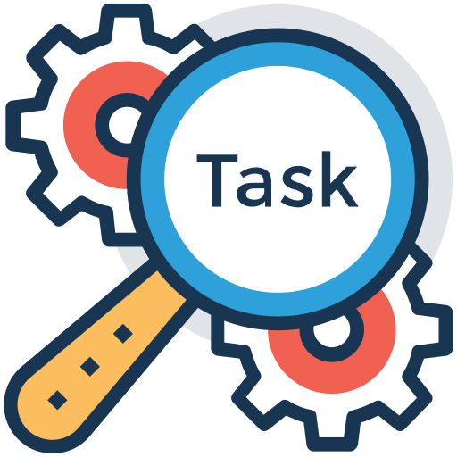

# Task Manager Application



The Task Manager Application is a web-based project built with Node.js that allows users to manage their tasks. Users can create, read, update, and delete tasks. Additionally, the application includes a user authentication and authorization system to ensure secure access to task management features.

## Features

- **User Authentication:** Users can create an account, log in, and log out securely.
- **Task Management:** Users can perform CRUD (Create, Read, Update, Delete) operations on their tasks.
- **Authorization:** Users can only access and manage their own tasks.
- **Responsive Design:** The application is designed to be responsive and accessible on various devices.

## Getting Started

These instructions will help you set up and run the Task Manager Application on your local machine.

### Prerequisites

Before you begin, ensure you have met the following requirements:

- [Node.js](https://nodejs.org/) installed on your machine.
- [MongoDB](https://www.mongodb.com/) database installed and running.

### Installation

1. Clone the repository to your local machine:

    ```bash
    git clone git@github.com:arifpirxada/nodejs-task-manager.git
    ```

2. Navigate to the project directory:

    ```bash
    cd nodejs-task-manager
    ```

3. Install the project dependencies:

    ```bash
    npm install
    ```

4. Create a `.env` file in the project root and configure the following environment variable:

    ```env
    MONGODB_URL=           # URL to your MongoDB database
    JWT_SECRET_KEY=        # Secret key for JWT (JSON Web Tokens)
    ```

5. Start the application:

    ```bash
    npm start
    ```

6. The Task Manager Application should now be running on `http://localhost:3000`.

## Usage

1. Open a web browser and navigate to `http://localhost:3000`.

2. Create a new account or log in if you already have one.

3. Use the application to create, read, update, and delete your tasks.